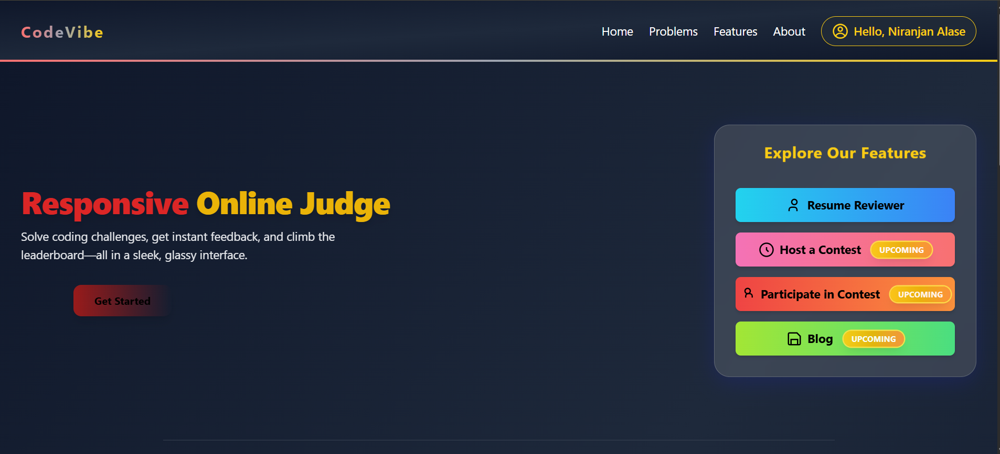
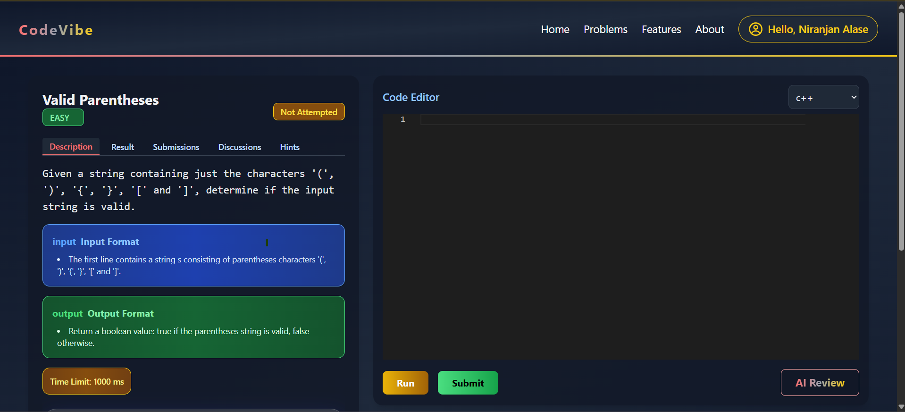
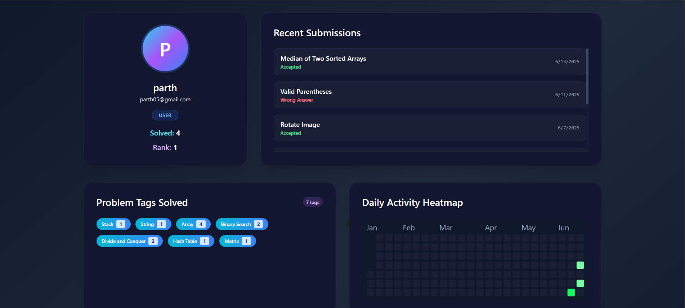

# 🚀 CodeVibe: MERN Online Judge Platform


[](https://online-judge-frontend-two.vercel.app/)

---


---

## 🌟 Overview

**CodeVibe** is a modern, full-stack Online Judge platform built with the MERN stack.  
It allows users to solve coding problems, run and submit code in multiple languages, get instant feedback, and participate in discussions—all in a beautiful, glassmorphism-inspired UI.

---

## ✨ Features

- 📝 **Problem Solving:** Browse, solve, and submit coding problems.
- ⚡ **Multi-language Support:** C++, Java, Python, JavaScript.
- 🧪 **Test Cases:** Automatic evaluation with custom and sample test cases.
- 🕒 **Time Limit Handling:** Detects infinite loops and timeouts.
- 💬 **Discussions:** Engage with the community on each problem.
- 🤖 **AI Review:** Get instant AI-powered feedback on your code.
- 📈 **Leaderboard & Dashboard:** Track your progress and compare with others.
- 🧑‍💻 **Authentication:** Secure login/signup with JWT and OAuth (Google, GitHub).
- 📄 **Resume Reviewer:** Upload your resume and get AI feedback.
- 🎨 **Modern UI:** Responsive, glassmorphism design with Tailwind CSS.

---

## 🖼️ Screenshots

<p align="center">
  
  
  
  
</p>

---

## 🛠️ Tech Stack

- **Frontend:** React, Tailwind CSS, React Router, React Hot Toast
- **Backend:** Node.js, Express.js, Mongoose, JWT, Passport.js
- **Database:** MongoDB
- **Code Execution:** Dockerized runners for C++, Java, Python, JavaScript
- **AI Services:** OpenAI API for code and resume review

---

## 🚀 Getting Started

### 1. **Clone the repository**
```bash
git clone https://github.com/Niranjan0524/online-Judge.git
cd online-Judge
```

### 2. **Setup Backend**
```bash
cd Backend
npm install
# Create a .env file (see .env.example)
npm start
```

### 3. **Setup Frontend**
```bash
cd ../Frontend
npm install
# Create a .env file (see .env.example)
npm run dev
```

### 4. **Environment Variables**

- **Backend:**  
  - `MONGO_URI` - MongoDB connection string  
  - `JWT_SECRET` - JWT secret  
  - `OPENAI_API_KEY` - For AI features  
  - `CLIENT_URL` - Frontend URL

- **Frontend:**  
  - `VITE_BACKEND_URL` - Backend API URL

---

## 🧑‍💻 Contributing

1. Fork this repo
2. Create your feature branch: `git checkout -b feature/your-feature`
3. Commit your changes: `git commit -m 'Add some feature'`
4. Push to the branch: `git push origin feature/your-feature`
5. Open a Pull Request

---


## 🙏 Acknowledgements

- [React](https://react.dev/)
- [Tailwind CSS](https://tailwindcss.com/)
- [MongoDB](https://mongodb.com/)
- [OpenAI](https://openai.com/)
- [LeetCode](https://leetcode.com/) (Inspiration)

---

## 💡 Contact

- **Author:** [Niranjan Alase](http://niranjanalase.netlify.app)
- **Email:** parthalase05gmali.com@gmail.com
- **LinkedIn:** [niranjan05](https://www.linkedin.com/in/niranjan05/)
- **GitHub:** [Niranjan0524](https://github.com/Niranjan0524)

---

> _Empowering coders. Building community. Level up with CodeVibe!_
